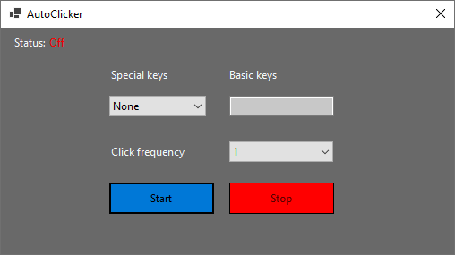
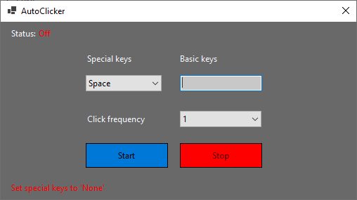
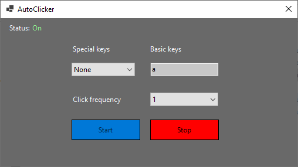

# AutoClicker
It is a simple application for inputting keyboard keys every certain amount of time

## Main features
* Select a special key like Alt, Shfit, ...
* Write any basic key like a, b, c, ...
* Select input frequency
* Start inputting certain key

## Screenshots

